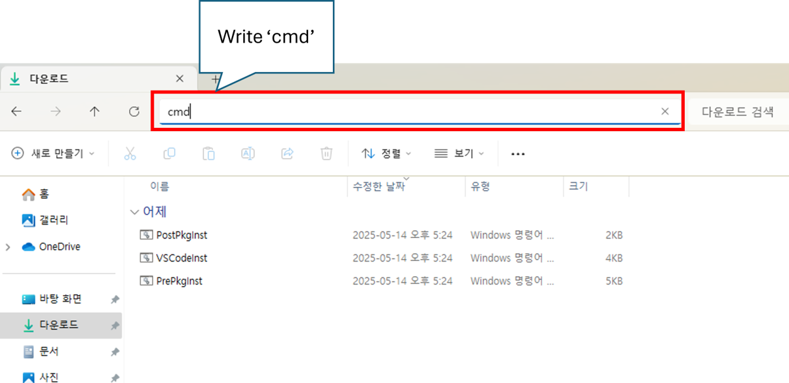

# TiCLE Lite

##

## Quick Start

**본 장비의 원활한 실습을 위해선 무선 네트워크 환경, CUDA를 지원하는 PC, Webcam 장비가 필요합니다.**

### Visual Studio Code
Visual Studio Code(VSCode)는 MS에서 Electron 프레임워크를 기반으로 개발된 무료 프로그램으로 추가로 원하는 확장 기능을 설치해야 IDE로 사용 가능합니다. 윈도우를 비롯해 리눅스 Mac을 모두 지원하며 파이썬을 비롯해 다양한 언어와 부가 기능을 수 많은 확장 기능으로 지원합니다.

### VSCode 설치 및 설정 
VSCode 편집기를 IDE로 사용하기 위해선 다양한 Extension들을 설치해주고 직접 설정해주어야 하는 불편함이 있습니다. 한백전자에서는 이러한 불편함을 해소시키기 위해 Windows에서 VSCode 및 pwsh 등 여러 편리한 개발환경들을 자동으로 설치해주는 스크립트를 제공합니다. 설치하는 방법은 다음과 같습니다.

아래 링크에 접속한 후 cmd 파일들을 모두 다운로드 받습니다.

- [Install File Link](https://github.com/hanback-lab/TiCLE/tree/main/tools)

파일을 다운로드 받은 후 탐색기로 다운로드 받은 위치로 이동한 후 탐색기 주소창에 'cmd' 라고 입력하여 명령 프롬프트를 실행합니다. 



명령 프롬프트에서 다음 명령을 순차적으로 실행합니다. 

```sh
.\PrePkgInst.cmd
.\VSCodeInst.cmd
.\PostPkgInst.cmd
```

이 과정을 통해 VSCode 및 필요한 패키지가 설치됩니다. 설치가 완료되면 다음 경로로 이동합니다. 

```sh
C:\VSCode\
```

폴더 내부에 Code.exe 파일을 실행하여 VSCode를 실행합니다. 

### Upyboard

Upyboard는 MCU 보드에 구축된 Micropython 환경에서의 프로그래밍을 보조하는 개발 툴입니다. 이 툴은 다양한 기능을 제공하고 빠른 속도로 동작하여 개발자로부터 하여금 편의성을 증진시켜줄 수 있습니다.

upyboard에 대한 자세한 사용법은 아래 사이트에서 확인하실 수 있습니다.

- https://github.com/PlanXLab/upyboard

#### 기능

제공되는 기능은 다음과 같습니다.
- **간편한 프로그램 실행** : 높은 추상화 및 간편한 환경설정들로 인해 보드 위에서의 Micropython 프로그램 실행의 간편성을 대폭 높입니다.
- **사용자 맞춤 환경설정** : 사용자 맞춤 설정을 통해 필요한 설정값을 미리 저장해 편의성을 증가시킬 수 있습니다.
- **강력한 보드 제어** : Soft Reset, Repl 접속 등 보드를 간단하고도 강력하게 제어할 수 있습니다.
- **저장소 접근 및 관리** : 보드의 저장소에 접근하고 파일들을 관리할 있어 라이브러리 업로드 등 보드의 활용도를 대폭 높일 수 있습니다.
- **자동 업데이트** : 업데이트 버전 등록 시 자동으로 감지하고 설치를 진행합니다.

#### 설치 방법

Upyboard 툴은 파이썬 패키지로써 Pypi에 등록되어 있어, pip로 간편하게 설치할 수 있습니다. 단, 다음 조건을 충족해야 합니다.

- Windows 11 이상
- **Python 3.10 이상**

```
pip install upyboard
```

### Upyboard 사용

우선, VSCode 상에서 작업할 위치에 폴더를 엽니다.


<br>

보드와 PC간의 연결 상태를 확인합니다. 그 후 터미널에 다음 명령어를 입력하여 PC에 연결된 보드의 시리얼 포트를 확인합니다.

```
upy scan
```


<br>

시리얼 포트를 확인하였다면 다음 명령어를 입력하여 현재 Workspace에 보드의 시리얼 포트 정보를 저장합니다. 

```
upy -s <시리얼 포트> env
```


<br>

환경 설정이 완료되었다면 TiCLE Lite를 초기화시킵니다. TiCLE Lite를 사용하기 위한 시스템 초기화 및 기본 라이브러리가 설치됩니다. 

```
upy init
```


### Hello World!

다음은 Micropython 프로그램을 작성하고 TiCLE Lite에 업로드하는 실습입니다. 

먼저 간단한 프로그램을 작성합니다. VSCode 왼쪽 상단에 'New File' Icon을 눌러 새 파일을 생성한 다음, 'main.py' 라고 이름을 지정합니다.

   
<br>

<br><br>


파일을 아래와 같이 작성합니다.

```python
print("Hello World!")
```

<br>

다음 명령어를 입력하여 프로그램 동작 결과를 확인합니다.

```
upy run main.py
```


경우에 따라 아래와 같이 `run` 을 생략하고 입력해도 실행시킬 수 있습니다.

```sh
upy main.py
```

### Demo : Snow animation

본격적인 실습에 들어가기 전 간단한 데모를 실행해보겠습니다. 장비에 부착된 WS2812 Pixel display를 사용하여 마치 눈이 오는 것과 같은 애니메이션을 출력하는 데모입니다.

데모 Micropython 코드는 아래 사이트에서 다운로드 받을 수 있습니다.

- https://github.com/hanback-lab/TiCLE-Lite/blob/main/etc/quick_demo.py

그 후 VSCode 터미널에서 다음과 같이 입력합니다.

```py
upy quick_demo.py
```

코드를 실행할 시 아래와 같이 눈이 내리는 애니메이션이 출력되는 것을 볼 수 있습니다.

