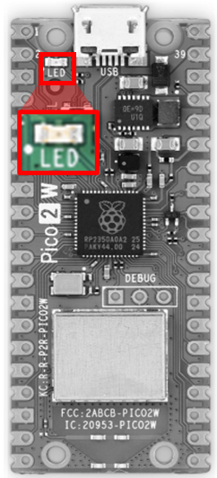

# 기본 제어

이 장에서는 Micropython을 통해 TiCLE LiTE 장비에 기초적인 제어를 하고자 합니다.

Micropython이란 Python 3 언어를 최소화 및 효율성을 증진시킨 언어이며, Python의 기본 문법과 표준 라이브러리의 기본 기능을 포함하고 마이크로컨트롤러와 같은 제한된 환경에서 실행되도록 기획된 언어입니다. 또한, `machine` 라이브러리를 기본으로 제공하여 마이크로컨트롤러의 기능 사용 및 확장 등의 작업들에 용이하게 사용할 수 있도록 제공해줍니다.

본 교재는 TiCLE Lite에 장착된 센서 및 액추에이터를 제어하는 수준으로써의 간략한 버전으로 설명을 제공합니다. 보다 더 자세한 기능에 대해 알아가고 싶으시다면 아래 링크를 참고해주시길 바랍니다.

- https://docs.micropython.org/en/latest/library/index.html#python-standard-libraries-and-micro-libraries

## GPIO

GPIO는 `General Purpose Input Output`의 약자로 말 그대로 범용으로 사용되는 입출력 포트를 의미합니다. 여러가지 다양한 용도로 사용될 수 있다는 것을 의미하기도 합니다. TiCLE Lite에는 마이크로컨트롤러 외에 여러가지 다양한 일을 수행하는 주변장치 및 소자들이 존재합니다. 이 주변 소자들은 MCU의 미리 정해진 인터페이스에 연결되어 동작 하는 것 들도 있지만, 그렇지 않은 경우가 더 많습니다. 이러한 다양한 주변 소자들을 동작 시키기 위해서는 그 주변소자들이 원하는 방식으로 인터페이스를 하여 원하는 신호를 보내주어야 합니다. 예를 들어 LED를 켜거나, 버저를 울리기 위해서는 그 소자에 0 혹은 1의 신호를 보내주어야 하고, TEXT-LCD에 글자를 출력하기 위해서는 좀 더 복잡한 병렬 신호들을 보내 주어야 합니다. 또한, 스위치나 마이크 등의 입력을 받기 위해서는 그 소자들로부터 나오는 신호를 받아들일 수 있는 통로를 가져야 합니다다 이와 같이 TiCLE Lite에서 일어나는 여러 가지 다양한 일들을 처리하기 위해 프로그래머가 마음대로 변형하면서 제어할 수 있도록 제공해 주는 I/O(입출력) 포트를 GPIO라고 합니다.

TiCLE Lite에 장착된 RP2350 마이크로컨트롤러 또한 많은 수의 GPIO 포트를 보유하고 있습니다. 사실 특수한 용도로 사용하는 몇몇 핀을 제외하고는 거의 모든 핀들이 GPIO로 사용할 수 있다고 보아도 무방합니다. 그만큼 마이크로컨트롤러에서 GPIO의 중요성은 매우 크다고 할 수 있으며, 어떤 고성능 마이크로컨트롤러나 SoC에서도 이러한 경향은 마찬가지입니다.

Micropython에서 GPIO 제어는 `machine` 라이브러리의 `Pin` 클래스를 사용하여 제어합니다.

### LED

아래 사진과 같이 Raspberry Pi Pico 2 W 위에 위치한 LED를 제어합니다.



VSCode 상에서 아래와 같이 코드를 작성한 후 'led.py' 라는 이름으로 저장합니다.

```py
# led.py
from machine import Pin
from utime

led_pin = Pin('LED', Pin.OUT)

led_pin.on()
utime.sleep_ms(1000)
led_pin.off()
utime.sleep_ms(1000)

led_pin.value = 1
utime.sleep_ms(1000)
led_pin.value = 0
utime.sleep_ms(1000)
```

4번 개행 줄의 `Pin` 클래스를 생성하는 과정을 주목해 봅니다. 상술하였듯 `machine` 라이브러리에는 마이크로컨트롤러 제어에 필요한 다양한 기능들이 담겨져 있으며, 그 기능들 중 GPIO 제어를 담당하고 있는 `Pin` 클래스를 들고와 인스턴스를 생성합니다. 인스턴스를 생성할 때 두 가지 기본 인자값을 받습니다. 젓 번째는 핀 번호이고, 두 번째는 입출력 방향입니다. 핀 번호는 제어하고자 하는 센서 및 액추에이터과 같은 주변장치가 연결된 핀 번호를 입력해주면 됩니다. 일반적으로 자연수 값이 입력되며, 지금과 같이 Raspberry Pi Pico 2 W 보드 위에 있는 LED를 제어할 때는 특수한 경우로 'LED' 라고 기입합니다. 입출력 방향은 각종 주변장치에 신호를 보낼 지, 아님 신호를 받을 지를 결정해주면 됩니다. 지금은 LED 출력을 제어해 줄 것이기 때문에 `Pin.OUT`, 즉 출력 방향으로 설정해줍니다.

그 이후의 코드는 총 2번 씩 LED가 번갈아 점멸하는 기능을 지시하는 코드입니다. 점멸 주기는 1초이며, 시간과 관련된 기능들이 포함된 라이브러리 `utime` 에서 명시된 시간만큼 동작을 정지시키는 `sleep_ms()` 함수를 통해 주기를 설정해줍니다. 여기서 `sleep_ms` 함수의 인자값은 miliseconds 단위이며, 1 밀리초는 $1*10^{-3}$ 초와 같습니다.

led와 연결된 핀을 제어하는 방법은 총 두 가지가 있습니다. 하나는 `on`/`off` 함수를 사용하는 것이고, 다른 하나는 Pin 클래스의 멤버 변수 `value`의 값을 조정하는 것입니다. `value` 변수는 프로퍼티로 설정되어 있어 실시간으로 값을 읽거나 받을 수 있고, `on`/`off` 함수 또한 본질적으로 `value` 변수의 값을 수정하고 있습니다. 결론적으로 두 가지 방법 다 동일한 결과를 출력하며, 코딩 스타일에 따라 선택할 수 있는 폭이 넓어진 것과 같습니다.

터미널에 다음 명령어를 입력하여 프로그램을 실행시키면, Raspberry Pi Pico 2 W에 부착된 LED가 점멸하는 것을 확인할 수 있습니다.

```sh
upy led.py
```

### Switch

아래 사진과 같이 위치한 Switch를 제어해 보겠습니다.


Raspberry Pi Pico 2 W에 부착되었던 LED와는 달리, Switch는 별도의 결선이 필요합니다. 점퍼 케이블 등을 이용하여 아래의 표, 사진을 참고하여 Pin을 결선시켜 줍니다.

| 명칭 | 핀 번호 |
| --- | ------ |
| UP | 18 |
| LEFT | 19 |
| DOWN | 20 |
| RIGHT | 21 |


VSCode 상에서 아래와 같이 코드를 작성한 후 'switch.py' 라는 이름으로 저장합니다.

```py
# switch.py
from machine import Pin
import utime

up_sw_pin = Pin(18, Pin.IN)
left_sw_pin = Pin(19, Pin.IN)
down_sw_pin = Pin(20, Pin.IN)
right_sw_pin = Pin(21, Pin.IN)

for i in range(10):
    print(f"up: {up_sw_pin.value}, left: {left_sw_pin.value}, down: {down_sw_pin.value}, right: {right_sw_pin.value}")
    utime.sleep_ms(500)
```

버튼의 입력을 받는 것 또한 `Pin` 클래스를 사용합니다. 상술하였듯 `value` 멤버 변수는 프로퍼티로 구현되었기 때문에, 실시간으로 핀의 상태값을 확인받을 수 있습니다.

터미널에서 다음 명령어를 입력해 프로그램을 실행합니다. 버튼을 눌림 상태에 따라 프로그램 출력값이 달라지는 것을 확인할 수 있습니다.

```sh
upy switch.py
```

### IR Remote

IR Remote란 적외선을 통해 지정된 명령 신호를 단방향으로 통신하는 것을 말합니다. IR 신호를 보내는 장치는 TiCLE Lite와 동봉된 IR 리모컨이며, 신호를 받는 장치는 아래 사진과 같이 위치한 센서입니다.


VSCode 상에서 아래와 같이 코드를 작성한 후 'ir.py' 라는 이름으로 저장합니다. 리모컨의 버튼 입력에 따라 ir 값이 바뀌는 것을 확인할 수 있습니다.

```py
# ir.py
from machine import Pin
import time

class IRNECPoll:
    def __init__(self, pin, active_low=True):
        self.p = pin if isinstance(pin, Pin) else Pin(pin, Pin.IN)
        self.al = active_low
        self.last = None
        self.last_ts = 0

    def _wait_edge(self, to_ms):
        t0 = time.ticks_ms()
        lv = self.p.value()
        while time.ticks_diff(time.ticks_ms(), t0) < to_ms:
            v = self.p.value()
            if v != lv:
                return lv, time.ticks_us()
        return None, None

    def _capture(self, start_to_ms=200, gap_us=14000, min_us=100, max_ms=120):
        lv, t0 = self._wait_edge(start_to_ms)
        if t0 is None: return None
        seg, start_ms, last = [], time.ticks_ms(), t0
        while time.ticks_diff(time.ticks_ms(), start_ms) < max_ms:
            v = self.p.value()
            if v != lv:
                t = time.ticks_us()
                d = time.ticks_diff(t, last)
                if d >= min_us: seg.append((lv, d))
                lv, last = v, t
            else:
                if time.ticks_diff(time.ticks_us(), last) > gap_us and len(seg) > 8:
                    break
        if not seg: return None
        out = []
        l, d = seg[0]
        for nl, nd in seg[1:]:
            if nl == l: d += nd
            else: out.append((l, d)); l, d = nl, nd
        out.append((l, d))
        m = 0 if self.al else 1
        return [(0 if L==m else 1, D) for L, D in out]

    def _inr(self, x, tgt, tol):
        return (tgt*(1-tol)) <= x <= (tgt*(1+tol))

    def _median(self, a):
        if not a: return 0
        a = sorted(a); return a[len(a)//2]

    def _nec_decode(self, fr, tol=0.25):
        i = 0
        while i < len(fr) and fr[i][0] == 1: i += 1
        fr = fr[i:]
        if len(fr) < 66: 
            if len(fr) >= 4:
                h_ok = (fr[0][0]==0 and self._inr(fr[0][1],9000,0.35)) and (fr[1][0]==1 and self._inr(fr[1][1],2250,0.35))
                if h_ok: return ("REPEAT",)
            return None
        if not (fr[0][0]==0 and self._inr(fr[0][1],9000,0.35)): return None
        if not (fr[1][0]==1 and self._inr(fr[1][1],4500,0.35)): return None
        spaces = [d for l,d in fr if l==1]
        if not spaces: return None
        med = self._median(spaces)
        lo = [v for v in spaces if v<=med]; hi = [v for v in spaces if v>med]
        if not lo or not hi: return None
        mu0 = sum(lo)//len(lo); mu1 = sum(hi)//len(hi)
        if mu0>mu1: mu0,mu1=mu1,mu0
        th = (mu0+mu1)//2
        bits = []
        idx = 2
        for _ in range(32):
            if idx+1 >= len(fr): return None
            if not (fr[idx][0]==0 and self._inr(fr[idx][1],560,0.5)): return None
            if fr[idx+1][0]!=1: return None
            b = 1 if fr[idx+1][1]>th else 0
            bits.append(b)
            idx += 2
        def b2(x):
            v=0
            for i in range(8): v|=(bits[x+i]&1)<<i
            return v
        b0,b1,b2v,b3=b2(0),b2(8),b2(16),b2(24)
        if b1 == (0xFF ^ b0) and b3 == (0xFF ^ b2v):
            return ("NEC", b0, b2v)
        if b3 == (0xFF ^ b2v):
            addr = (b1<<8)|b0
            return ("NECX", addr, b2v)
        return None

    def read(self, start_to_ms=200, gap_us=14000, min_us=100, max_ms=120, repeat_window_ms=400):
        fr = self._capture(start_to_ms, gap_us, min_us, max_ms)
        if not fr: return None
        r = self._nec_decode(fr)
        if not r: return None
        if r[0]=="REPEAT":
            if self.last and time.ticks_diff(time.ticks_ms(), self.last_ts)<=repeat_window_ms:
                return self.last
            return None
        if r[0] in ("NEC","NECX"):
            self.last = (r[1], r[2])
            self.last_ts = time.ticks_ms()
            return self.last
        return None

ir = IRNECPoll(pin=17)

while True:
    pkt = ir.read()
    if pkt:
        a,c = pkt
        if a<=0xFF: s = f"A=0x{a:02X} C=0x{c:02X}"
        else: s = f"A=0x{a:04X} C=0x{c:02X}"
        print(s)
    time.sleep_ms(5)
```

이 코드는 적외선 수신기를 통해 리모컨에서 들어오는 신호를 감지한 뒤, NEC 프로토콜을 사용해 데이터를 해석합니다. 신호의 길이와 간격을 비교하여 버튼에 해당하는 값을 찾아내며, 같은 버튼을 눌렀을 때는 항상 일정한 결과가 나오도록 설계되어 있습니다.

각 함수는 비교적 단순한 역할을 합니다. 신호가 처음 들어올 때까지 기다리고, 일정 시간 동안 감지된 신호를 하나의 묶음으로 저장합니다. 그 안의 패턴을 살펴 NEC 형식에 맞는 데이터인지 확인하고, 주소와 명령 값을 구분해 반환합니다. 또한 버튼을 길게 누를 때 반복되는 신호는 이전에 해석된 값으로 처리합니다.

이 과정을 거치지 않으면 신호가 불규칙해져 잡음이 섞이고, 결과가 불안정해집니다. 따라서 이러한 절차를 통해서만 안정적이고 의미 있는 데이터를 얻을 수 있습니다.

터미널에서 다음 명령어를 입력해 프로그램을 실행합니다. 리모컨 버튼의 눌림 상태에 따라 프로그램 출력값이 달라지는 것을 확인할 수 있습니다.

```sh
upy ir.py
```

터미널 출력 결과

```
A=0x00 C=0x52
A=0x00 C=0x42
A=0x00 C=0x42
A=0x00 C=0x42
A=0x00 C=0x42
```

이렇게 해서 `machine` 라이브러리를 사용해 코드를 작성하였습니다. 하지만, 코드의 난이도가 너무 어려우며 길이도 매우 방대합니다. 본 교재에서는 캡스톤 디자인이 주 목적이기에 이를 간략히 추상화한 라이브러리 파일을 제공해드립니다.

<details>
<summary>ir_remote.py</summary>

```python
# ir_remote.py

from machine import Pin
import time
from collections import deque

def us():
    return time.ticks_us()

def diff(a, b):
    return time.ticks_diff(a, b)

def in_range(v, target, tol=0.25):
    lo = target * (1.0 - tol)
    hi = target * (1.0 + tol)
    return lo <= v <= hi

NEC_HDR_MARK   = 9000
NEC_HDR_SPACE  = 4500
NEC_RPT_SPACE  = 2250
NEC_BIT_MARK   = 560
NEC_ZERO_SPACE = 560
NEC_ONE_SPACE  = 1690
NEC_FRAME_BITS = 32
NEC_TRAIL_MARK = 560
NEC_GAP        = 30000

SIRC_HDR_MARK  = 2400
SIRC_HDR_SPACE = 600
SIRC_ONE_MARK  = 1200
SIRC_ZERO_MARK = 600
SIRC_BIT_SPACE = 600
SIRC_GAP       = 15000


class IRFrame:
    def __init__(self, protocol, address=None, command=None, bits=None, value=None, repeat=False, raw=None):
        self.protocol = protocol
        self.address = address
        self.command = command
        self.bits = bits
        self.value = value
        self.repeat = repeat
        self.raw = raw or []

    def __repr__(self):
        return "<IRFrame proto=%s addr=%s cmd=%s bits=%s repeat=%s>" % (
            self.protocol, self.address, self.command, self.bits, self.repeat
        )


class IRReceiver:
    def __init__(self, pin, active_low=True, buf_len=256, gap_us=None, cb=None):
        self.pin = pin if isinstance(pin, Pin) else Pin(pin, Pin.IN, Pin.PULL_UP if active_low else Pin.PULL_DOWN)
        self.active_low = active_low
        self.buf = deque((),buf_len)
        self.last_edge = us()
        self.last_level = self.pin.value()
        self.gap_us = gap_us or NEC_GAP
        self.cb = cb
        self._last_nec = None
        self.pin.irq(trigger=Pin.IRQ_RISING | Pin.IRQ_FALLING, handler=self._irq)

    def _irq(self, pin):
        t = us()
        lv = pin.value()
        dt = diff(t, self.last_edge)
        try:
            self.buf.append((dt, self.last_level))
        except IndexError:
            pass
        self.last_edge = t
        self.last_level = lv

    def _drain_frame(self):
        if not self.buf:
            return None
        local = []
        n = len(self.buf)
        gap_idx = -1
        for i in range(n):
            dt, lvl = self.buf[i]
            if dt >= self.gap_us:
                gap_idx = i
                break
        if gap_idx < 0:
            return None
        take = gap_idx
        for _ in range(take):
            local.append(self.buf.popleft())
        if self.buf:
            self.buf.popleft()
        marks_spaces = []
        for dt, lvl in local:
            is_mark = (lvl == 0) if self.active_low else (lvl == 1)
            marks_spaces.append((dt, 'M' if is_mark else 'S'))
        while marks_spaces and marks_spaces[0][1] == 'S':
            marks_spaces.pop(0)
        seq = [int(dt) for dt, _ in marks_spaces]
        if len(seq) < 4:
            return None
        return seq

    def _decode_nec(self, seq):
        if len(seq) < 4:
            return None
        mark0, space0 = seq[0], seq[1]
        if in_range(mark0, NEC_HDR_MARK) and in_range(space0, NEC_RPT_SPACE):
            rpt = IRFrame("NEC", repeat=True, raw=seq)
            if self._last_nec:
                rpt.address = self._last_nec.address
                rpt.command = self._last_nec.command
                rpt.bits = self._last_nec.bits
                rpt.value = self._last_nec.value
            return rpt
        if not (in_range(mark0, NEC_HDR_MARK) and in_range(space0, NEC_HDR_SPACE)):
            return None
        bits = []
        i = 2
        while i + 1 < len(seq):
            m = seq[i]
            s = seq[i + 1]
            if in_range(m, NEC_BIT_MARK):
                if in_range(s, NEC_ONE_SPACE):
                    bits.append(1)
                elif in_range(s, NEC_ZERO_SPACE):
                    bits.append(0)
                else:
                    if in_range(m, NEC_TRAIL_MARK) and i+1 == len(seq)-1:
                        break
                    return None
                i += 2
            else:
                if in_range(m, NEC_TRAIL_MARK) and (i == len(seq)-1):
                    break
                return None
        if len(bits) not in (NEC_FRAME_BITS,):
            return None
        value = 0
        for idx, b in enumerate(bits):
            value |= (b & 1) << idx
        addr     =  value        & 0xFF
        addr_inv = (value >> 8)  & 0xFF
        cmd      = (value >> 16) & 0xFF
        cmd_inv  = (value >> 24) & 0xFF
        frame = IRFrame("NEC",
                        address=addr,
                        command=cmd,
                        bits=len(bits),
                        value=value,
                        repeat=False,
                        raw=seq)
        self._last_nec = frame
        return frame

    def _decode_sirc(self, seq):
        if len(seq) < 4:
            return None
        mark0, space0 = seq[0], seq[1]
        if not (in_range(mark0, SIRC_HDR_MARK) and in_range(space0, SIRC_HDR_SPACE)):
            return None
        bits = []
        i = 2
        while i + 1 < len(seq):
            m = seq[i]
            s = seq[i + 1]
            if not in_range(s, SIRC_BIT_SPACE):
                return None
            if in_range(m, SIRC_ONE_MARK):
                bits.append(1)
            elif in_range(m, SIRC_ZERO_MARK):
                bits.append(0)
            else:
                return None
            i += 2
        if len(bits) not in (12, 15, 20):
            return None
        value = 0
        for idx, b in enumerate(bits):
            value |= (b & 1) << idx
        if len(bits) == 12:
            cmd = value & 0x7F
            addr = (value >> 7) & 0x1F
        elif len(bits) == 15:
            cmd = value & 0x7F
            addr = (value >> 7) & 0xFF
        else:
            cmd = value & 0x7F
            addr = (value >> 7) & 0xFFFF
        return IRFrame("SIRC", address=addr, command=cmd, bits=len(bits), value=value, raw=seq)

    def read(self, timeout_ms=0):
        t0 = time.ticks_ms()
        while True:
            seq = self._drain_frame()
            if seq:
                for decoder in (self._decode_nec, self._decode_sirc):
                    frame = decoder(seq)
                    if frame:
                        if self.cb:
                            try:
                                self.cb(frame)
                            except:
                                pass
                        return frame
                return IRFrame("UNKNOWN", raw=seq)
            if timeout_ms <= 0:
                return None
            if time.ticks_diff(time.ticks_ms(), t0) > timeout_ms:
                return None
            time.sleep_ms(1)

    def clear_buffer(self):
        self.buf.clear()

    def set_callback(self, cb):
        self.cb = cb
```

</details>

위 라이브러리 코드는 다음 명령어를 통해 TiCLE Lite에 설치시켜줄 수 있습니다.

```sh
upy put ir_remote.py lib/
```

아래는 IR 신호를 받는 클래스에 대한 API 문서입니다.

**IRReceiver 클래스**
- `IRReceiver(pin, active_low=True, buf_len=256, gap_us=None, cb=None)` : IR 수신 핀에 인터럽트를 걸어 신호 간격을 버퍼에 기록한 뒤, NEC/SIRC 프레임으로 파싱하도록 초기화합니다. cb에 콜백함수를 입력하면 프레임이 해석될 때마다 즉시 호출합니다.
- `read(timeout_ms=0) -> IRFrame | None` : 버퍼에서 완성된 프레임을 하나 읽어 NEC/SIRC 중 해석 가능한 프로토콜이면 `IRFrame`을 반환합니다. timeout_ms 동안 프레임이 없으면 None을 반환합니다.
- `clear_buffer() -> None` : 내부 수신 버퍼를 모두 비우고 새로 수신하도록 준비합니다.
- `set_callback(cb) -> None` : 프레임 해석 시 호출할 콜백을 설정합니다. cb(frame) 형태로 호출되며, 이미 등록된 콜백을 교체하실 수 있습니다.

`IRReceiver` 클래스에서 `read()` 함수 호출 시 `IRFrame` 클래스를 반환하는데, 이 `IRFrame` 클래스는 다음 정보를 가지고 있습니다.
- `protocol` : 프로토콜 (NEC/SIRC)
- `address` : 주소
- `command` : 명령어

위 클래스를 사용하여 아래 예제를 작성해볼 수 있습니다.

```py
# ir.py
from ir_remote import IRReceiver

ir = IRReceiver(pin=17)

print("Listening for IR signals...")

while True:
    frame = ir.read(timeout_ms=200)
    if not frame:
        continue

    if frame.protocol == "NEC":
        print("NEC Frame   cmd=0x%02X  addr=0x%02X" % (frame.command, frame.address))
    else:
        print("Unknown Frame  len=%d" % len(frame.raw))
```
## ADC

ADC란 'Analog to Digital Conversion' 의 약자로써, 문자 그대로 아날로그 신호를 디지털 신호로 변환시켜주는 장치를 의미합니다. 디지털 신호만 처리하는 컴퓨터와는 다르게 우리 세상 속에는 수없이 많은 아날로그 신호들이 있습니다. 대표적인 예로 빛을 들자면, High/Low만 구분할 수 있는 디지털과는 달리 빛의 양, 즉 조도량은 High/Low로 표현할 수 없습니다. 이와 같은 아날로그 신호들은 ADC를 거쳐 디지털 신호로 변환된 뒤 그 값을 확인시켜줄 수 있게 해줍니다.

Micropython에선 `machine` 라이브러리의 `ADC` 클래스를 사용하여 제어합니다.

### VR

VR이란 자기 저항의 변화를 측정하는 센서로써, 다이얼이 돌려진 값을 정확하게 파악할 수 있는 센서입니다. 아래 사진과 같이 위치한 VR을 제어해봅니다.


VSCode 상에서 아래와 같이 코드를 작성한 후 'vr.py' 라는 이름으로 저장합니다.

```python
```

### CdS

CdS란 조도량을 측정할 수 있는 센서입니다. 아래 사진과 같이 위치한 Cds를 제어해봅니다.


VSCode 상에서 아래와 같이 코드를 작성한 후 'cds.py' 라는 이름으로 저장합니다.

### MIC

MIC란 주변 소음량을 측정할 수 있는 센서입니다. 아래 사진과 같이 위치한 MIC를 제어해봅니다.


VSCode 상에서 아래와 같이 코드를 작성한 후 'mic.py' 라는 이름으로 저장합니다.

## PWM

펄스 폭 변조(PWM Pulse Width Modulation)는 디지털 방식으로 다양한 아날로그 신호를 흉내 내는 기술로 HIGH와 LOW로 구성된 펄스에 HIGH 구간의 비율을 조절하는 것으로 설명할 수 있습니다.

PWM 신호를 정의하는 매개 변수는 주파수와 듀티 사이클입니다. 주파수는 펄스, 듀티 사이클은 펄스 폭에 해당하는 것으로 출력 장치의 전원에 주파수를 듀티 사이클로 순환시킨 PWM 출력을 전달하면, 출력 장치는 이를 정전압 아날로그 신호로 인식합니다. 

듀티 사이클은 HIGH 구간의 펄스 폭을 주기에 대한 백분율로 표현하는데, 주파수가 고정된 상태에서 듀티 사이클을 바꾸면 출력되는 평균 전압도 변합니다. 100% 듀티 사이클은 출력 레벨이 HIGH임을 의미하고 0% 듀티 사이클은 LOW임을 의미합니다. 50% 듀티 사이클은 출력 레벨이 HIGH와 LOW의 중간입니다. 60% 듀티 사이클은 출력을 60% 동안만 HIGH로 유지하므로 주기가 10 us (마이크로 초; 1 us = $1*10^{-6}$ 초)(100kHz)인 경우 6 us 동안 출력이 HIGH를 유지하며, HIGH일 때 최대 전압이 3.3V라면 평균 전압은 3.3V * 0.6 = 1.98V입니다. 

Micropython에서의 PWM 제어는 `machine` 라이브러리의 `PWM` 클래스를 사용하여 제어합니다.

### Piezo

아래 사진과 같이 위치한 Piezo를 제어해봅니다.


VSCode 상에서 아래와 같이 코드를 작성한 후 'piezo.py' 라는 이름으로 저장합니다.

```python
# piezo.py

```

각 음계에 해당하는 주파수는 다음과 같습니다. 4 옥타브 기준입니다.

| 음계 | 주파수 |
| --- | ----- |
| C(도) | 261.6256 |
| D(레) | 293.6648 |
| E(미) | 329.6276 |
| F(파) | 349.2282 |
| G(솔) | 391.9954 |
| A(라) | 440.0000 |
| B(시) | 493.6256 |

터미널에서 다음 명령어를 입력해 프로그램을 실행합니다. 1초 단위로 음계가 올라가는 것을 확인할 수 있습니다.

```sh
upy piezo.py
```

### Servo Motor

아래 사진과 같이 위치한 Servo Motor를 제어해봅니다.


VSCode 상에서 아래와 같이 코드를 작성한 후 'servo.py' 라는 이름으로 저장합니다.

```py
servo.py
from machine import Pin, PWM
import time

class Servo:
    def __init__(self, pin, freq=50):
        self.pwm = PWM(Pin(pin))
        self.pwm.freq(freq)
        self.min_duty = 1638
        self.max_duty = 8191

    def write(self, angle):
        angle = max(0, min(180, angle))
        duty = self.min_duty + (self.max_duty - self.min_duty) * angle // 180
        self.pwm.duty_u16(duty)

    def deinit(self):
        self.pwm.deinit()

servo = Servo(pin=2)
for ang in range(0, 181, 30):
    servo.write(ang)
    time.sleep(0.5)
for ang in range(180, -1, -30):
    servo.write(ang)
    time.sleep(0.5)
servo.deinit()
```

```py
# servo.py
from ticle.ext import ServoMotor
import utime

servo_pin = 2

servo = ServoMotor([servo_pin])

while True:
    for i in range(0,180):
        servo.angle = i
        utime.sleep_ms(100)
```

초기화 시 PWM 주파수를 50Hz로 설정하며, write(angle) 함수를 통해 0~180도 범위의 각도를 듀티비로 변환하여 제어합니다.

deinit() 함수는 PWM 출력을 종료하여 서보모터의 동작을 멈추며, 예제에서는 일정 각도로 움직였다가 다시 원위치로 돌아오도록 반복 동작합니다.

터미널에서 다음 명령어를 입력해 프로그램을 실행합니다. 서보모터의 각도가 0~180도에서 30도 간격으로 회전하는 것을 확인할 수 있습니다.


```sh
upy servo.py
```

### WS2812

아래 사진과 같이 위치한 WS2812를 제어해봅니다.


VSCode 상에서 아래와 같이 코드를 작성한 후 'ws2812.py' 라는 이름으로 저장합니다.

```py
# ws2812.py


터미널에서 다음 명령어를 입력해 프로그램을 실행합니다. 버튼을 눌림 상태에 따라 프로그램 출력값이 달라지는 것을 확인할 수 있습니다.

```sh
upy ws2812.py
```


## I2C

프로세서에 내장되어 근거리 칩 사이 통신에 사용되는 I2C Inter-Integrated Circuit는 동기식 직렬 통신 방식 중 하나로 풀업 저항이 연결된 SDA Serial Data와 SCL Serial Clock이라는 두 개의 반 이중 방식 Half-Duplex 오픈 드레인 버스 라인을 사용해 프로세서와 주변장치 사이에 데이터를 교환합니다. 

I2C는 마스터와 슬레이브 동작을 지원하며, 다중 마스터도 가능합니다. 각 디바이스는 송신기나 수신기로 동작합니다. I2C의 7bit 주소는 128개의 다른 슬레이브 주소까지 허용하며 400kHz까지의 데이터 전송 속도를 지닙니다.

Micropython에선 `machine` 라이브러리의 `I2C` 클래스를 사용하여 제어합니다. 단, 후술할 두 주변 장치는 복잡한 프로토콜과 제어 방식을 가지고 있어 직접 I2C 제어 구문을 작성하기에는 난이도가 높습니다. 따라서 아래 주변장치를 제어하는 건 `ticle.ext` 라이브러리로 대체합니다.

### LCD

아래 사진과 같이 위치한 LCD를 제어해봅니다.


VSCode 상에서 아래와 같이 코드를 작성한 후 'lcd.py' 라는 이름으로 저장합니다.

### IMU

아래 사진과 같이 위치한 IMU를 제어해봅니다.


VSCode 상에서 아래와 같이 코드를 작성한 후 'imu.py' 라는 이름으로 저장합니다.