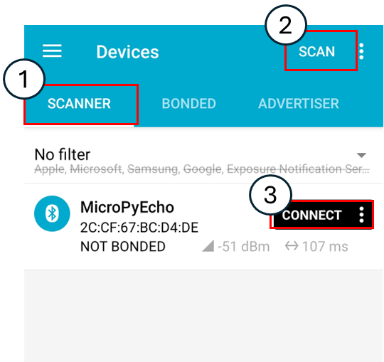
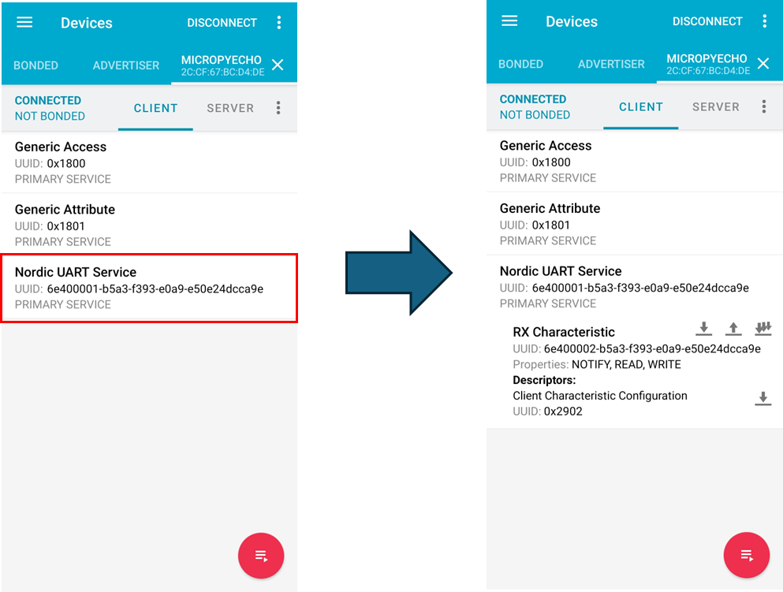
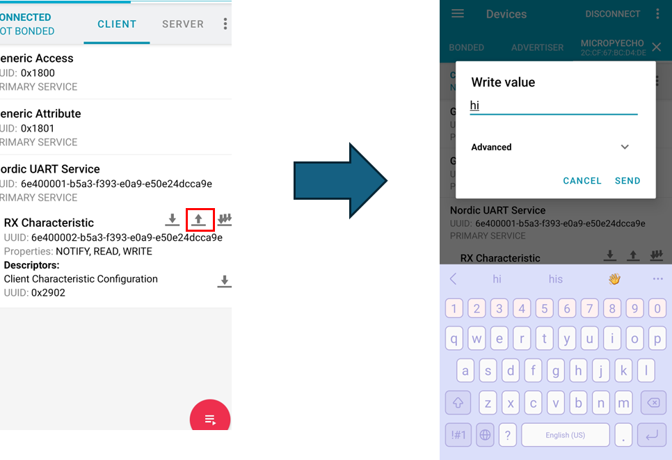
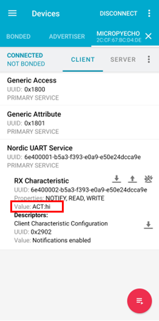

# BLE 개요

BLE(Bluetooth Low Energy)는 블루투스 기술의 한 종류로, 이름 그대로 **낮은 전력으로 무선 통신을 수행하기 위해 설계된 기술**입니다.
2.4GHz 대역(40개의 채널)을 사용하며, 기존의 Bluetooth Classic과 달리 **짧은 시간 동안 소량의 데이터를 주기적으로 전송**하는 데 최적화되어 있습니다.

Bluetooth Classic은 오디오 스트리밍이나 파일 전송처럼 많은 데이터를 지속적으로 주고받는 데 적합하지만, BLE는 센서 데이터, 스마트워치, IoT 기기 등 **전력 효율이 중요한 환경**에서 주로 사용됩니다.

자세한 기술적 비교는 Bluetooth 공식 문서를 참고하실 수 있습니다.
👉 [Bluetooth Official: Technology Overview](https://www.bluetooth.com/learn-about-bluetooth/tech-overview/)


## Classic과 BLE의 비교 요약

| 구분    | Bluetooth Classic | Bluetooth Low Energy (BLE) |
| ----- | ----------------- | -------------------------- |
| 주요 목적 | 오디오, 파일 등 대용량 전송  | 센서, IoT 등 저전력 전송           |
| 연결 유지 | 지속적 연결 유지         | 필요 시 빠른 연결/해제              |
| 소비 전력 | 비교적 높음            | 매우 낮음                      |
| 전송 속도 | 최대 약 3 Mbps       | 약 1 Mbps                   |
| 활용 예시 | 스피커, 이어폰          | 스마트워치, 비콘, 센서              |

# BLE의 핵심 구조

## 1. Advertising (광고 모드)

BLE는 **연결 없이도 데이터를 전송할 수 있는 모드**를 제공합니다.
이를 광고(Advertising)라고 부르며, 기기가 주기적으로 주변에 자신의 존재와 간단한 정보를 알리는 방식입니다.
예를 들어, 온도 센서가 일정 간격으로 현재 온도를 광고하면, 스마트폰이 이를 스캔(Scan)하여 표시할 수 있습니다.

광고 데이터는 “길이–타입–값(TLV)” 구조로 이루어져 있으며, 다음과 같은 항목들을 담을 수 있습니다.

* Flags (기기의 기본 속성)
* Local Name (기기 이름)
* Service UUID (제공 서비스 식별자)

이 구조 덕분에 BLE 기기는 **빠르고 간단하게** 주변과 통신할 수 있습니다.

## 2. GATT 구조 (Generic Attribute Profile)

BLE가 연결(Connected) 상태로 들어가면, **GATT(Generic Attribute Profile)** 구조를 통해 데이터를 교환합니다.
모든 데이터는 Attribute(속성) 단위로 구성되며, **Service → Characteristic → Descriptor** 형태로 계층화되어 있습니다.

* **Service**: 하나의 기능 단위를 정의합니다. 예) Heart Rate Service, Battery Service
* **Characteristic**: 실제 데이터 항목을 의미합니다. 예) 심박수 값, 배터리 잔량 등
* **Descriptor**: 특성에 대한 추가 정보(단위, 설명 등)를 담습니다.

## 3. UUID (Universally Unique Identifier)

각 Service, Characteristic, Descriptor는 고유한 **UUID**로 식별됩니다.
UUID는 16비트 또는 128비트로 구성되며, 다음과 같은 차이가 있습니다.

| 종류           | 설명                         | 예시                                     |
| ------------ | -------------------------- | -------------------------------------- |
| 16-bit UUID  | Bluetooth SIG에서 표준으로 정의    | `0x180F` (Battery Service)             |
| 128-bit UUID | 사용자가 자유롭게 정의 (Custom UUID) | `6E400001-B5A3-F393-E0A9-E50E24DCCA9E` |

BLE의 확장성과 호환성을 위해, 대부분의 기본 서비스는 16비트 UUID를 사용하지만, **사용자 정의 BLE 서비스**를 만들 때는 128비트 UUID를 사용합니다.

자세한 UUID 리스트는 공식 문서에서 확인하실 수 있습니다.
👉 [Bluetooth Assigned Numbers (16-bit UUID List)](https://www.bluetooth.com/specifications/assigned-numbers/)

# Micropython에서의 BLE

MicroPython은 BLE 기능을 지원하는 보드(예: ESP32, Raspberry Pi Pico W 등)에서 `ubluetooth` 모듈을 통해 BLE 기능을 제어할 수 있습니다.
이를 이용하면 **간단한 GATT 서버**나 **Advertising 장치**를 직접 구현할 수 있습니다.

다음은 BLE의 기본적인 개념을 실습할 수 있는 예제입니다.


## BLE Echo Server

BLE 통신 Echo 서버를 만들어봅니다.TiCLE Lite가 **Peripheral(서버)** 역할을 하며, 스마트폰이나 PC의 BLE 스캐너 앱이 **Central(클라이언트)** 역할을 합니다.

Central이 보드로 문자열 데이터를 전송하면, 보드는 그 데이터를 그대로 다시 돌려보냅니다(Echo).

```python
# ble_echo_server.py
import ubluetooth
import utime
import struct
from machine import Pin

_IRQ_CENTRAL_CONNECT = 1
_IRQ_CENTRAL_DISCONNECT = 2
_IRQ_GATTS_WRITE = 3

SERVICE_UUID = ubluetooth.UUID('6E400001-B5A3-F393-E0A9-E50E24DCCA9E')
CHARACTERISTIC_UUID = ubluetooth.UUID('6E400002-B5A3-F393-E0A9-E50E24DCCA9E')

FLAG_READ_WRITE_NOTIFY = ubluetooth.FLAG_READ | ubluetooth.FLAG_WRITE | ubluetooth.FLAG_NOTIFY

BLE_SERVICE_DEFINITION = (
    SERVICE_UUID,
    (
        (CHARACTERISTIC_UUID, FLAG_READ_WRITE_NOTIFY),
    ),
)

class BLE_Echo_Server:
    def __init__(self, name='MicroEcho'):
        self.ble = ubluetooth.BLE()
        self.ble.active(True)
        self.ble.irq(self._irq)
        ((self.char_handle,),) = self.ble.gatts_register_services((BLE_SERVICE_DEFINITION,))
        self.connections = set()
        self.name = name
        self._advertise()

    def _irq(self, event, data):
        if event == _IRQ_CENTRAL_CONNECT:
            conn_handle, addr_type, addr = data
            self.connections.add(conn_handle)
            print(f"[{self.name}] connected: {addr}")
        elif event == _IRQ_CENTRAL_DISCONNECT:
            conn_handle, addr_type, addr = data
            if conn_handle in self.connections:
                self.connections.remove(conn_handle)
            print(f"[{self.name}] disconnected: {addr}")
            self._advertise()
        elif event == _IRQ_GATTS_WRITE:
            conn_handle, value_handle = data
            if conn_handle in self.connections and value_handle == self.char_handle:
                data_bytes = self.ble.gatts_read(self.char_handle)
                try:
                    data_str = data_bytes.decode('utf8').strip()
                    print(f"[{self.name}] received: {data_str}")
                    self.ble.gatts_write(self.char_handle, data_bytes)
                    self.ble.gatts_notify(conn_handle, self.char_handle)
                except Exception as e:
                    print(f"[{self.name}] error: {e}")

    def _advertise(self):
        adv_data = bytearray()
        adv_data.extend(struct.pack('BB', 2, 0x01))
        adv_data.append(0x06)
        name_bytes = self.name.encode('utf8')
        adv_data.extend(struct.pack('BB', len(name_bytes) + 1, 0x09))
        adv_data.extend(name_bytes)
        self.ble.gap_advertise(100000, adv_data=bytes(adv_data))
        print(f"[{self.name}] advertising...")

    def is_connected(self):
        return len(self.connections) > 0

if __name__ == '__main__':
    echo_server = None
    try:
        echo_server = BLE_Echo_Server(name='MicroPyEcho')
        print("server running...")
        while True:
            utime.sleep_ms(500)
    except KeyboardInterrupt:
        print("Interrupted by user")
    except Exception as e:
        print(f"Error: {e}")
    finally:
        print("BLE server stopped.")
        if echo_server is not None:
            echo_server.ble.active(False)
```

## 코드 설명

### 1. UUID 및 서비스 정의

```python
SERVICE_UUID = ubluetooth.UUID('6E400001-B5A3-F393-E0A9-E50E24DCCA9E')
CHARACTERISTIC_UUID = ubluetooth.UUID('6E400002-B5A3-F393-E0A9-E50E24DCCA9E')
```

* 128비트 사용자 정의 UUID를 사용합니다.
* `SERVICE_UUID`는 GATT의 상위 서비스, `CHARACTERISTIC_UUID`는 해당 서비스의 세부 데이터 항목을 의미합니다.
* 실제 제품 개발 시, Bluetooth SIG가 정의한 16비트 UUID를 사용하는 것이 권장되지만, 학습 단계에서는 자유롭게 정의할 수 있습니다.

### 2. GATT 서비스 등록

```python
((self.char_handle,),) = self.ble.gatts_register_services((BLE_SERVICE_DEFINITION,))
```

* `gatts_register_services()`는 BLE 장치에 GATT 테이블을 등록합니다.
* 등록 후 반환되는 `char_handle`은 해당 특성을 참조하기 위한 핸들 값으로, 이후 데이터 읽기/쓰기/알림에 사용됩니다.

### 3. 이벤트 처리 (IRQ 콜백)

```python
def _irq(self, event, data):
    if event == _IRQ_CENTRAL_CONNECT:
        ...
    elif event == _IRQ_GATTS_WRITE:
        ...
```

* `_IRQ_CENTRAL_CONNECT`: 클라이언트가 연결되었을 때 호출됩니다.
* `_IRQ_CENTRAL_DISCONNECT`: 연결이 해제되면 다시 광고를 시작합니다.
* `_IRQ_GATTS_WRITE`: 클라이언트가 데이터를 전송했을 때 실행되며, 이 예제에서는 받은 데이터를 그대로 다시 돌려주는 **Echo 기능**을 수행합니다.

### 4. 광고 시작

```python
def _advertise(self):
    self.ble.gap_advertise(100000, adv_data=bytes(adv_data))
```

* `gap_advertise()`는 BLE 장치가 Advertising 모드로 전환되도록 합니다.
* 이 코드에서는 약 100ms 주기로 자신의 이름을 광고합니다.
* BLE 스캐너 앱(nRF Connect 등)에서 `"MicroPyEcho"`라는 장치를 검색할 수 있습니다.

### 5. 메인 함수

```python
if __name__ == '__main__':
    echo_server = None
    try:
        echo_server = BLE_Echo_Server(name='MicroPyEcho')
    ...
```

* 프로그램 실행 시 BLE Echo 서버를 실행시킵니다. 만약 여러 대의 TiCLE을 동시에 사용한다면, 매개변수 'name' 의 값을 변경하여 서로 다른 TiCLE을 구분시키는 데 용이합니다.
* 무한 루프를 유지하며 BLE 이벤트를 대기합니다.
* 사용자가 `Ctrl+C`로 종료하면 BLE가 비활성화되며 서버가 종료됩니다.

## 실행

먼저, 터미널에서 다음 명령어를 입력하여 서버를 실행시킵니다.

```sh
upy ble_echo_server.py
```

다음으로 안드로이드 스마트폰을 준비합니다. 그 후 앱스토어에서 'nRF Connect for Mobile' 앱을 설치합니다.

앱을 실행 시 아래와 같은 화면이 출력되며, 'SCANNER' 탭에서 좍측 상단에 'SCAN' 버튼을 터치하여 TiCLE의 BLE Echo server를 탐색합니다. 어느정도의 시간이 지난 후, 사진과 같이 'MicroPyEcho' 라는 리스트 타일이 출력된다면 'CONNECT' 버튼을 터치합니다.



연결에 성공하면 아래 사진과 같이 새로운 탭으로 전환됩니다. 그리고 아래 사진에 표기된 구역을 터치하면 테이터를 송신할 수 있는 구역이 활성화됩니다.



아래 사진과 같이 업로드 아이콘 버튼을 누르게 되면 데이터를 송신할 수 있는 메시지 박스가 출력됩니다. 여기서 아무 데이터나 입력하여 전송해봅니다.



이후, 아래 사진과 같이 BLE Echo server에서 수신받은 데이터에 'ACT:' 를 앞에 붙인 후 다시 송신시켜주는 것을 확인할 수 있습니다.



터미널 출력 결과

```
[MicroPyEcho] advertising...
[MicroPyEcho] connected: <memoryview>
[MicroPyEcho] received: hi 
[MicroPyEcho] sent: ACT:hi
```